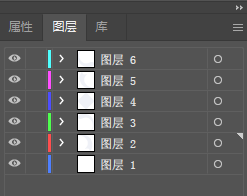
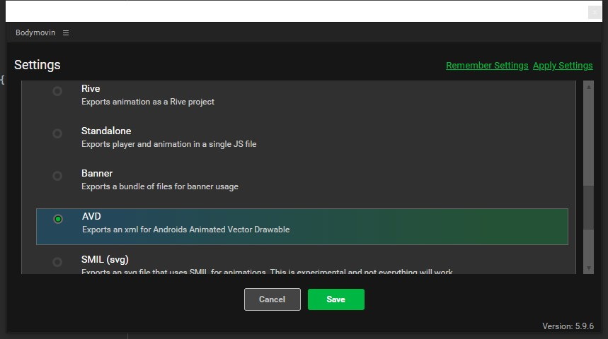

# AfterEffects-to-AVD
以制作splash_screen动画为例记录一下从AI到AE到AVD或Lottie的工作流程  
#### AI中  
需将所有图层释放到最外层，然后保存成.ai文件  

#### AE中  
将.ai文件导入素材区并将各图层导入  
选中各图层，右键-创建-从矢量图层创建形状  
制作好动画后 打开窗口-扩展-bodymovin插件
直接进行渲染则是lottie可用的json文件，下滑找到AVD即可渲染为AVD的xml文件  

